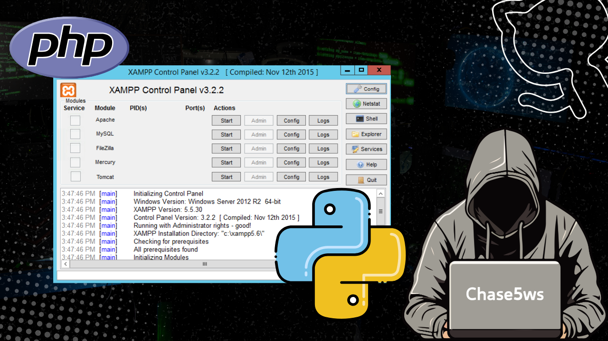

RFID 後台上傳工具（客製版）README

---
專案說明

RFID 後台上傳工具（客製版） 是一款基於 Python Tkinter 開發的桌面應用程式，專為 RFID 用戶數據管理與後台交互設計。  
本工具提供三步式引導操作，支持 IPC 設備配置、Excel 用戶數據編輯、Apache 服務控制，並可自動同步配置至 PHP 後端，實現 RFID 用戶的批量註冊、個別刪除、全量重新上傳等核心業務功能，適用於需要快速管理 RFID 用戶數據的場景（如門禁系統、會員管理等）。

---
功能特色

- 三步式引導操作：配置管理 → 數據編輯 → 服務控制，流程清晰，易於上手。

- 靈活配置管理：支持 IPC IP 配置、XAMPP 路徑設置、Excel 數據文件關聯，配置自動保存至本地。

- PHP 配置自動同步：無需手動修改 PHP 代碼，工具自動更新後端配置（IP、TID、用戶列表等）。

- Excel 數據安全處理：支持用戶數據（UserID/使用者名稱/卡片號碼）的新增、編輯、刪除，並提供嚴格的數據驗證（卡片號7位數字、重複檢查等）。

- Apache 服務一鍵控制：支持 XAMPP/Apache 服務的啟動、停止，自動檢測 80 端口占用狀態。

- 核心業務操作：支持 RFID 用戶個別刪除、全量刪除、批量註冊、重新上傳等功能。

- 用戶體驗優化：彈窗自動居中、操作二次確認、數據統計顯示，降低誤操作風險。

---
安裝指南

1. 環境依賴

需提前安裝以下軟件/環境，工具運行的基礎依託：

- Python 3.7 及以上版本（推荐 3.9/3.10）

- XAMPP （包含 Apache + PHP 環境，用於運行 RFID 後端服務）

- Excel 文件（用戶數據來源，需符合指定格式）

2. 下載專案

將專案文件下載至本地目錄，確保以下核心文件完整：

# 下載專案（示例，可根據實際來源調整）
git clone <你的專案網址>
cd <專案資料夾>  # 進入專案根目錄
    

核心文件清單（缺一不可）：

- edit.py （主程式文件，工具核心邏輯）

- rfid_set_cfg.php （後端配置文件，用於 IPC IP 配置）

- rfid_del_user.php （用戶個別刪除後端文件）

- rfid_all_del_user.php （用戶全量刪除後端文件）

- rfid_register_user.php （用戶批量註冊後端文件）

- test.php （測試文件，用於驗證後端服務是否正常）

- user_list.xlsx （用戶數據文件，需符合格式要求）

3. 安裝 Python 相依套件

打開命令列終端，進入專案根目錄，執行以下命令安裝依賴套件：

# 安裝核心依賴（pandas 用於 Excel 處理，openpyxl 用於 xlsx 格式支援）
pip install pandas openpyxl psutil
    

備註：工具啟動時會自動檢查依賴，若未安裝會自動執行安裝命令，可無需手動操作。

4. 配置 Excel 數據文件

`user_list.xlsx` 為用戶數據來源文件，需嚴格符合以下格式要求：

- 必須包含 3 個核心列（忽略大小寫和前後空格）：`userid`、`username`、`cardno`

- 各列說明：
        

  - userid：用戶唯一標識（數字，工具支援自動遞增）

  - username：使用者名稱（非空）

  - cardno：卡片號碼（必須為 7 位數字，不可重複）

- 示例格式：

userid

username

cardno

1

張三

1234567

2

李四

7654321

5. 配置 XAMPP 目錄

確保 XAMPP 已安裝完成，並記錄其安裝路徑（後續工具中配置使用）：

- Windows 預設路徑：`C:\xampp\`

- macOS 預設路徑：`/Applications/XAMPP/`

將 RFID 後端文件（所有 .php 文件）放置於 XAMPP 的 htdocs 目錄下，示例路徑：`C:\xampp\htdocs\rfid_tool\`

---
啟動方式

1. 直接啟動（推薦，簡單便捷）

打開命令列終端，進入專案根目錄，執行以下命令：

python edit.py

執行後會自動彈出工具主界面，進入三步式操作流程。

2. 後台運行（Windows 系統）

若需工具在後台運行，可借助 `pythonw.exe` 啟動（無命令列窗口）：

# 找到 Python 安裝目錄下的 pythonw.exe（示例路徑）
C:\Python39\pythonw.exe <你的專案路徑>\edit.py
    

3. 關閉工具

有兩種安全關閉方式：

- 在 Step3 界面點擊「完成」按鈕，工具會自動停止 Apache 服務並退出。

- 直接關閉工具主窗口（不推薦，可能導致 Apache 服務未正常停止）。

---
使用流程（三步式操作）

Step1：確認檔案位置（配置管理）

核心任務：完成 IPC IP、XAMPP 路徑、Excel 文件的配置，並同步至 PHP 後端。

1. 配置 IPC IP：在四段輸入框中分別輸入 IP 段（如 192.168.1.100），系統會自動驗證 IP 合法性（0-255 數字）。

2. 選擇 XAMPP 路徑：點擊「選擇資料夾」按鈕，選中本地 XAMPP 安裝目錄（如 C:\xampp\）。

3. 選擇 User_List 檔案：點擊「選擇檔案」按鈕，選中 `user_list.xlsx` 文件。

4. 保存並同步配置：點擊「保存配置並更新 IP 配置」按鈕，工具會自動保存配置至 `rfid_tool.setting.txt`，並更新 `rfid_set_cfg.php` 的 IPC IP 配置。

5. 點擊「下一步」進入 Step2（若配置不完整，工具會給出警告提示）。

Step2：編輯用戶數據（數據管理）

核心任務：查看、編輯 Excel 中的用戶數據，支持新增、修改、刪除操作。

1. 數據加載：工具會自動讀取 Step1 中選擇的 Excel 文件，並在表格中展示用戶數據（總數會顯示在界面右側）。

2. 編輯選中行：選中表格中的某一行，點擊「編輯選中行」按鈕，在彈窗中修改使用者名稱或卡片號碼（UserID 不可修改），點擊「保存修改」生效。

3. 新增行：點擊「新增行」按鈕，工具會自動生成下一個 UserID，輸入使用者名稱和 7 位卡片號碼（不可重複），點擊「新增」生效。

4. 刪除選中行：選中表格中的某一行，點擊「刪除選中行」按鈕，二次確認後刪除數據（僅刪除本地 Excel 數據，未同步至 RFID 後端）。

5. 保存修改到 Excel：所有數據操作完成後，點擊「保存修改到 Excel」按鈕，將修改內容寫回 `user_list.xlsx` 文件。

6. 點擊「下一步」進入 Step3（點擊「返回上一步」可重新修改配置）。

Step3：Apache 服務控制（業務操作）

核心任務：啟動 Apache 服務，執行 RFID 用戶的刪除、註冊、重新上傳等業務操作。

1. 啟動 Apache 服務：點擊「啟動」按鈕，工具會自動啟動 Apache 和 XAMPP 控制面板，並檢查 80 端口占用狀態，啟動成功後給出提示。

2. 個別刪除：點擊「個別刪除」按鈕，在彈窗中選擇要刪除的用戶，二次確認後工具會更新 `rfid_del_user.php` 並打開刪除 URL 執行操作。

3. 重新上傳：點擊「重新上傳」按鈕，二次確認後工具會先執行全量刪除（更新 `rfid_all_del_user.php`），再執行批量註冊（更新 `rfid_register_user.php`），並分別打開對應 URL。

4. 測試：點擊「測試」按鈕，工具會打開 `test.php` 頁面，用於驗證後端服務是否正常運行。

5. 完成操作：所有業務操作結束後，點擊「完成」按鈕，工具會停止 Apache 服務並退出。

---
檔案結構

<專案根目錄>/
├── edit.py                # 主程式文件（核心邏輯，工具入口）
├── rfid_tool.setting.txt  # 配置文件（自動生成，存儲 IPC/XAMPP/Excel 路徑等）
├── rfid_set_cfg.php       # 後端配置文件（存儲 IPC IP 配置）
├── rfid_del_user.php      # 個別刪除後端文件（存儲刪除用戶ID、API URL等）
├── rfid_all_del_user.php  # 全量刪除後端文件（存儲 API URL、TID等）
├── rfid_register_user.php # 批量註冊後端文件（存儲用戶列表、API URL等）
├── test.php               # 後端測試文件（驗證服務是否正常）
├── user_list.xlsx         # 用戶數據文件（核心數據來源）
├── my_icon.ico            # 工具圖標文件（可選）
└── README.md              # 工具說明文檔（本文件）
    

---
注意事項

- 配置合法性：Step1 中若未配置有效的 IPC IP、XAMPP 路徑或 Excel 文件，無法進入 Step2，請務必確保配置完整。

- PHP 文件完整性：所有 .php 文件必須放置於 XAMPP 的 htdocs 目錄下（如 rfid_tool 子目錄），否則工具無法正常更新配置和執行業務操作。

- 端口占用問題：Apache 默認使用 80 端口，若 80 端口被其他程序（如 IIS、迅雷等）占用，Apache 無法啟動，請關閉占用端口的程序後重試。

- 數據安全：Excel 數據修改後需點擊「保存修改到 Excel」按鈕，否則修改內容會丢失；刪除操作需謹慎，二次確認後再執行。

- 後端驗證：執行刪除、註冊等操作後，請查看瀏覽器打開的頁面，確認操作是否成功（工具僅負責觸發操作，不負責後端結果驗證）。

- 配置文件保護：`rfid_tool.setting.txt` 存儲核心配置，請勿隨意刪除或修改，否則工具可能無法正常啟動。

---
常見問題（FAQ）

Q1：啟動工具時提示「缺少 pandas/openpyxl 套件」？

A1：工具會自動嘗試安裝依賴套件，若安裝失敗，請手動執行命令 `pip install pandas openpyxl`。

Q2：Step1 中點擊「保存配置」提示「更新 rfid_set_cfg.php 失敗」？

A2：檢查兩點：① rfid_set_cfg.php 文件是否存在於專案根目錄；② 文件是否有寫入權限（右鍵文件 → 屬性 → 安全 → 勾選寫入權限）。

Q3：Step2 中無法讀取 Excel 文件，提示「缺少必要列」？

A3：檢查 user_list.xlsx 文件是否包含 `userid`、`username`、`cardno` 三列（忽略大小寫和前後空格），請調整列名後重新嘗試。

Q4：Step3 中點擊「啟動」按鈕，Apache 無法啟動？

A4：大概率是 80 端口被占用，打開命令列執行 `netstat -ano | findstr :80` 查看占用端口的程序 PID，在工作管理員中結束對應程序後重試。

Q5：執行「個別刪除/重新上傳」後，瀏覽器打開頁面提示「404 頁面不存在」？

A5：檢查 PHP 文件是否放置於 XAMPP 的 htdocs 目錄下，並確認訪問 URL 正確（如 http://localhost/rfid_tool/rfid_del_user.php）。

---
授權

MIT License

---
> 本工具為 專用於 RFID 用戶數據管理，如需商業應用請自行評估風險。  
> 開發者：ChaseTseng

